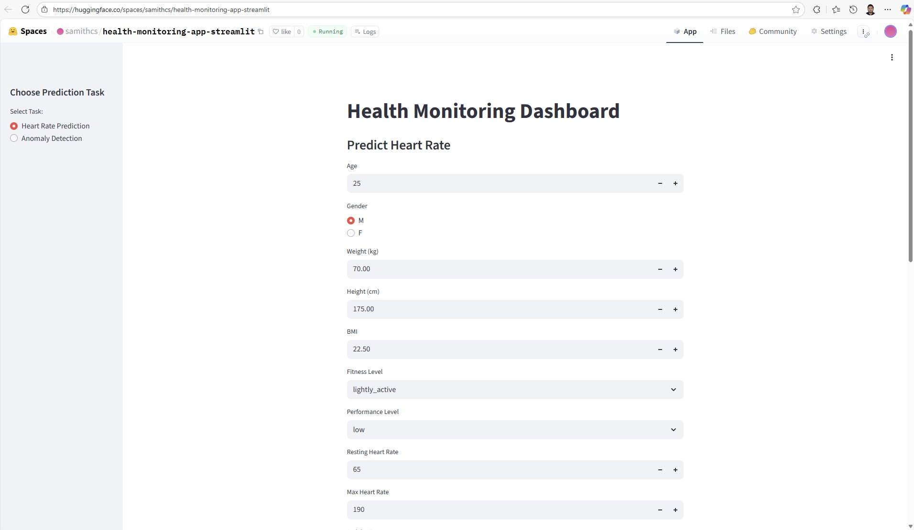
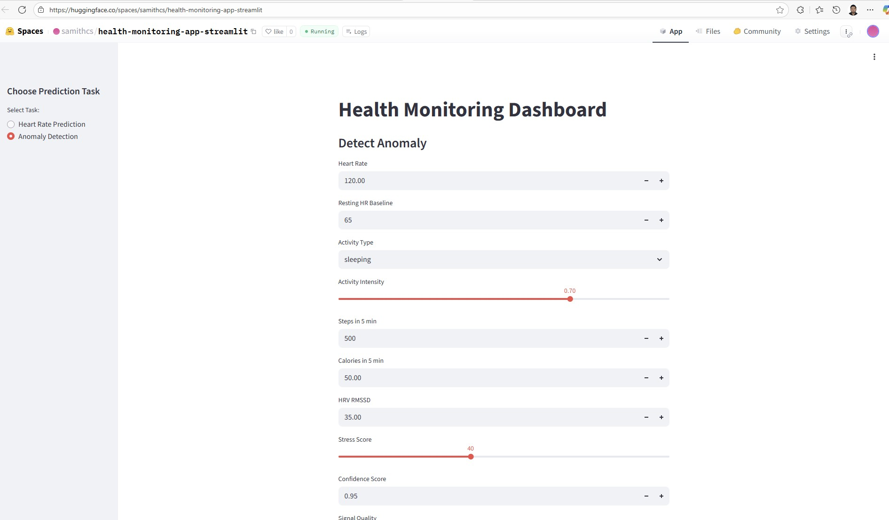

Photo by <a href="https://unsplash.com/@joshua_chehov?utm_content=creditCopyText&utm_medium=referral&utm_source=unsplash">Joshua Chehov</a> on <a href="https://unsplash.com/photos/a-close-up-of-a-monitor-screen-with-a-heart-beat-beXUIzvxW-Q?utm_content=creditCopyText&utm_medium=referral&utm_source=unsplash">Unsplash</a>
      
      


[](https://github.com/ellerbrock/open-source-badges/)

Badge [source](https://shields.io/)


# Heart_Rate_Anomaly_Detector

This project showcases a complete machine learning lifecycle — from data generation and transformation to model development, evaluation, and deployment. Two models were trained:

- Heart Rate Detector

- Heart Anomaly Detector

The solution integrates MLOps best practices with CI/CD pipelines to ensure automation, reproducibility, and scalability.

Key Deployment Platforms:

- FastAPI (REST API)

- Streamlit (Interactive UI)

- Docker (Containerization)

- AWS EC2 (Cloud Hosting)

- Hugging Face Spaces (FastAPI & Streamlit apps)

This project demonstrates not only the technical aspects of model building but also the operational way of machine learning models across diverse platforms.


Hugging Face Spaces Streamlit App link : [https://huggingface.co/spaces/samithcs/health-monitoring-app-streamlit](https://huggingface.co/spaces/samithcs/health-monitoring-app-streamlit)
Hugging Face Spaces Fast API  link : [https://samithcs-health-monitoring-app-fastapi.hf.space/docs](https://samithcs-health-monitoring-app-fastapi.hf.space/docs)
Docker link : [https://hub.docker.com/r/samithc/health-monitoring-app-api](https://hub.docker.com/r/samithc/health-monitoring-app-api)


## Authors

- [Samith Chimminiyan](https://www.github.com/samithcsachi)

## Table of Contents

- [Authors](#Authors)
- [Table of Contents](#table-of-contents)
- [Problem Statement](#problem-statement)
- [Tech Stack](#tech-stack)
- [Data source](#data-source)
- [Quick glance at the results](#Quick-glance-at-the-results)
- [Lessons learned and recommendation](#lessons-learned-and-recommendation)
- [Limitation and what can be improved](#limitation-and-what-can-be-improved)
- [Work Flows](#workflows)
- [Run Locally](#run-locally)
- [Explore the notebook](#explore-the-notebook)
- [Contribution](#contribution)
- [License](#license)

## Problem Statement 

Cardiovascular diseases are among the leading causes of death worldwide, and continuous monitoring of heart activity is crucial for early detection of health risks. However, traditional monitoring devices can be expensive, and manual interpretation of heart data often requires medical expertise.

The problem this project addresses is the lack of accessible, automated, and real-time monitoring tools that can:

Predict heart rate based on user and activity parameters.

Detect anomalies in heart rate patterns that may indicate potential health issues.

The goal is to design a machine learning system that can accurately predict and flag anomalies in heart rate data, while being easily deployable across different platforms for real-world usability.

## Tech Stack


- Python 
- Jupyter Notebook 
- Pandas 
- NumPy 
- Faker 
- PyYAML, python-box, ensure 
- Scikit-learn 
- Joblib 
-FastAPI 
- Uvicorn 
-Pydantic 
-Streamlit 
-Docker 
-Git LFS 
-Hugging Face Hub 
-AWS EC2 

## Data source

Data Source Link : - [https://www.kaggle.com/datasets/samithsachidanandan/heart-rate](https://www.kaggle.com/datasets/samithsachidanandan/heart-rate)

This is a synthetic dataset generated using python library faker. Data includes the details over the period of one year.

## Quick glance at the results

Streamlit App in Hugging Face Space 




FAST API in Hugging Face Space  


## Lessons learned and recommendation

Throughout this project, I gained valuable hands-on experience in building and deploying end-to-end machine learning systems.

Key Lessons Learned:

- Successfully implemented a two-model project (Heart Rate Prediction & Heart Anomaly Detection).

- Developed and deployed models using FastAPI, Streamlit, Docker, AWS EC2, and Hugging Face Spaces.

- Overcame challenges with large dataset and model sizes, which could not be directly hosted on GitHub or Streamlit Cloud. This led me to explore alternative deployment approaches such as Hugging Face model hosting and cloud-based deployment.

- Gained practical exposure to fine-tuning models for performance improvements.

Model Performance Improvements:

**Initial Training Results**

- Regression: Train RMSE: 4.0151 | Test RMSE: 8.2909 | Train MAE: 2.9742 | Test MAE: 6.6035 | Test R²: 0.8896

- Classification: Train Accuracy: 0.9011 | Test Accuracy: 0.8978 | Precision: 0.0060 | Recall: 0.0934 | F1 Score: 0.0113

**Final Training Results (after fine-tuning)**

- Regression: Train RMSE: 2.9274 | Test RMSE: 7.5917 | Train MAE: 2.0870 | Test MAE: 5.9427 | Test R²: 0.9075

- Classification: Train Accuracy: 0.9642 | Test Accuracy: 0.9489 | Precision: 0.0064 | Recall: 0.0467 | F1 Score: 0.0113


## Limitation and what can be improved

- Synthetic Data Dependence: The dataset was generated synthetically, which may not fully capture the variability and complexity of real-world physiological signals. This limits the generalizability of the models to actual healthcare scenarios.

- Classification Model Performance: Although accuracy improved after fine-tuning, the precision, recall, and F1 score remained low, indicating difficulty in reliably detecting rare anomalies.

- Large Model and Dataset Size: Model artifacts were too large to be directly stored on GitHub or deployed on certain platforms like Streamlit Cloud, requiring alternative deployment strategies.

- Limited Real-Time Validation: The models were not tested on streaming or real-time physiological data, which is critical in a production healthcare setting.

- Data Quality & Diversity: Incorporate real-world datasets or more advanced synthetic data generation methods (e.g., GANs, time-series simulators) to improve realism and robustness.

- Model Optimization: Explore advanced architectures (e.g., ensemble models, deep learning approaches) and hyperparameter tuning to improve classification precision and recall.

- Handling Imbalanced Data: Apply techniques such as SMOTE, anomaly detection algorithms, or cost-sensitive learning to better handle rare anomaly cases.

- Efficient Model Deployment: Experiment with model compression techniques (quantization, pruning, ONNX) to reduce size and make deployments more lightweight.

- Real-Time Integration: Extend the solution to handle live data streams and integrate monitoring systems for anomaly alerts.

## Workflows

1. Update config.yaml
2. Update schema.yaml
3. Update params.yaml
4. Update entity
5. Update the configuration manager in src config
6. Update the components 
7. Update the pipeline
8. Update the main.py
9. Update the app.py
10. Update the streamlit_app.py
11. Update Dockerfile
12. Update AWS EC2
13. Update Hugging Face 

## Run Locally

Initialize git

```bash
git init
```

Clone the project

```bash
git clone https://github.com/samithcsachi/Heart_Rate_Anomaly_Detector.git
```

Open Anaconda Prompt and Change the Directory and Open VSCODE by typing code .

```bash
cd E:/Heart_Rate_Anomaly_Detector

```

Create a virtual environment 

```bash
python -m venv venv

```

```bash
.\venv\Scripts\activate   
```


install the requirements

```bash
pip install -r requirements.txt
```


```bash

python main.py

```

Run the FAST API 

```bash

uvicorn app:app --host 127.0.0.1 --port 8000 --reload

```
Run the streamlit app 

```bash

streamlit run streamlit_app.py
```


## Explore the notebook

GitHub :  [https://github.com/samithcsachi/Heart_Rate_Anomaly_Detector](https://github.com/samithcsachi/Heart_Rate_Anomaly_Detector)


## Contribution

Pull requests are welcome! For major changes, please open an issue first to discuss what you would like to change or contribute.

## License

MIT License

Copyright (c) 2025 Samith Chimminiyan

Permission is hereby granted, free of charge, to any person obtaining a copy
of this software and associated documentation files (the "Software"), to deal
in the Software without restriction, including without limitation the rights
to use, copy, modify, merge, publish, distribute, sublicense, and/or sell
copies of the Software, and to permit persons to whom the Software is
furnished to do so, subject to the following conditions:

The above copyright notice and this permission notice shall be included in all
copies or substantial portions of the Software.

THE SOFTWARE IS PROVIDED "AS IS", WITHOUT WARRANTY OF ANY KIND, EXPRESS OR
IMPLIED, INCLUDING BUT NOT LIMITED TO THE WARRANTIES OF MERCHANTABILITY,
FITNESS FOR A PARTICULAR PURPOSE AND NONINFRINGEMENT. IN NO EVENT SHALL THE
AUTHORS OR COPYRIGHT HOLDERS BE LIABLE FOR ANY CLAIM, DAMAGES OR OTHER
LIABILITY, WHETHER IN AN ACTION OF CONTRACT, TORT OR OTHERWISE, ARISING FROM,
OUT OF OR IN CONNECTION WITH THE SOFTWARE OR THE USE OR OTHER DEALINGS IN THE
SOFTWARE.

Learn more about [MIT](https://choosealicense.com/licenses/mit/) license

## Contact
If you have any questions, suggestions, or collaborations in data science, feel free to reach out:
- 📧 Email: [samith.sachi@gmail.com](mailto:samith.sachi@gmail.com)
- 🔗 LinkedIn: [www.linkedin.com/in/samithchimminiyan](https://www.linkedin.com/in/samithchimminiyan)
- 🌐 Website: [www.samithc.github.io](https://samithcsachi.github.io/)

